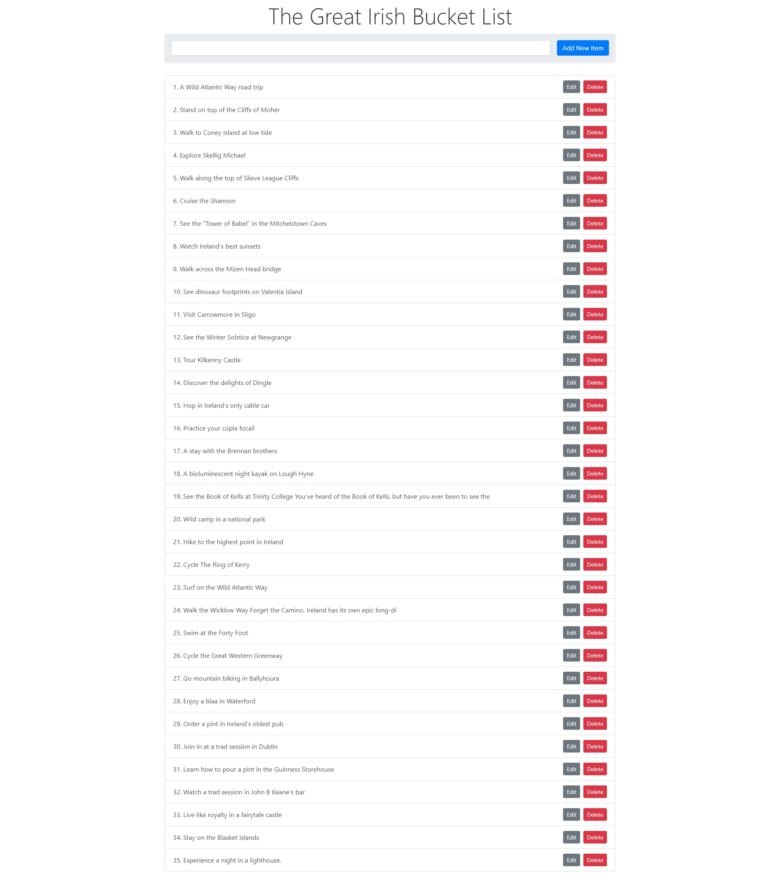

<h1 align="center">The Great Irish Bucket List<br>Simple To-Do App in Node.js</h1>

<p align="center">
</p>

### Table of Contents

- [Introduction](#introduction)
  - [Package used](#package-used)
- [Instructions for running the application locally](#instructions-for-running-the-application-locally)
- [Live application](#live-application)
- [Project Schema](#project-schema)
- [Credentials](#credentials)
- [Start Command](#start-command)
- [Connecting to the MongoDB Cluster remotely](#connecting-to-the-mongodb-cluster-remotely)
  - [DB Connection String](#db-connection-string)
  - [Using Axios](#using-axios)
  - [Working with Promises in JavaScript](#working-with-promises-in-javascript)
  - [Using the HTML5 feature: data-id](#using-the-html5-feature-data-id)
  - [Using event.target.getAttribute()](#using-eventtargetgetattribute)
  - [Deleting Data](#deleting-data)
- [Using an Ansyncronous method to create data on the fly](#using-an-ansyncronous-method-to-create-data-on-the-fly)
- [Using browser side rendering to cut down on duplication](#using-browser-side-rendering-to-cut-down-on-duplication)
- [Sanitization of HTML for security of user input](#sanitization-of-html-for-security-of-user-input)

# Introduction

This is a quick, basic and simple "to-do" application demonstrating client side JavaScript DOM manipulation, validation using the sanitize-html NPM package, MongoDB as the database for document storage and retrieval, along with server-side JavaScript code in Node.js on an Express backend server back-end.
Protected routes with WWW-Authenticate and user input sanitized with sanitize-html@2.7.0.

## Package used

- [x] express@4.17.3
- [x] mongodb@4.4.0
- [x] nodemon@2.0.15
- [x] sanitize-html@2.7.0

# Instructions for running the application locally

To run the application for the first time, clone or download the repo and run the following commands:

- `npm install`
- `nodemon server`

This will start a development server on `PORT:3000`

- Open a browser and navigate to the following URL `http://localhost:3000/`

Create an .env file and enter the following:

- MONGOCLIENT_CONNECTION_STRING=<your_connection_string_goes_here>

Where <your_connection_string_goes_here> is your own unique connection string to your own MongoDB cluster.

# Live application

To view the live application visit the following URL:

- [https://the-great-irish-bucket-list.herokuapp.com/](https://the-great-irish-bucket-list.herokuapp.com/)

---

# Project Schema

```
.
├── public
│   ├── browser.js -> Client-side JavaScript
├── server.js -> Server-side code in Node.js on an Express Back-end
├── .env -> environmental variables
├── .package.json -> packages
```

# Credentials

Application security using WWW-Authenticate with base-64 encoding. Enter the following credentials at the alert prompt:

- username: discover
- password: ireland

Alternatively, change these via entering different credentials and retrieving the base-64 from the server command line and exchange the code.

# Start Command

`npm run watch`

# Connecting to the MongoDB Cluster remotely

- [MongoDB - Log in to your account](https://account.mongodb.com/account/login)

## DB Connection String

Open your Cluster and retrieve your connection string

- connect your application
  - select Node.js driver

> Provide database details

- Database Name: **\_\_\_\_**
- Collection: **\_\_\_**

Update the connection string with:

- username
- password
- database name

## Using Axios

You can use Axios to tell the web browser to send a request to the server, without submitting a form, or visiting a URL.
You can juse send a request to the server on the fly, behind the scenes.

This is usually done in the modern way by using a feature modern web browsers have called _**fetch**_.

But instead, we will use _**axios**_.

Axios lets us keep the code that we write, super clean and super minimal

- [Axios Docs (Instructions)](https://github.com/axios/axios)

Get the link to the script from the documentation, i.e.:

```js
<script src="https://cdn.jsdelivr.net/npm/axios/dist/axios.min.js"></script>
```

Paste this within the res.send element within the server.js (Node JavaScript file) to output this script to the browser.

## Working with Promises in JavaScript

A promise is useful when we are not sure how long an action is going to take, these are used within the Axios requests.

Within the .then() is where you include a function that is not going to run until the action has had a chance to complete.

Within the .catch() is where you include a function to include for if the action runs into the problem

## Using the HTML5 feature: data-id

This is a HTML5 feature that enables data to be embedded right within the HTML

This enables the retrieval of the id of the field within the edit button which enables the change or update that will be recorded in the database.

## Using event.target.getAttribute()

We can use this to retrieve the id of the object within the client-side JavaScript code.

## Deleting Data

- New method in the browser js file (frontend) to delete the element from the document and call axios
- New method in the server js file (backend) to listen to the post request (of delete)

# Using an Ansyncronous method to create data on the fly

> Get whatever value the user enters in the input, then use Axios to send off an Asyncronous request to our node server

in the server.js send back JSON object that represents the new element id that was created to the browser

# Using browser side rendering to cut down on duplication

by using JSON.stringify() we can instead pass the data from the Object from the server to the browser
So now we can delete the HTML template within the server and instead make this browser based instead

# Sanitization of HTML for security of user input

This is completed using sanitize-html NPM package
